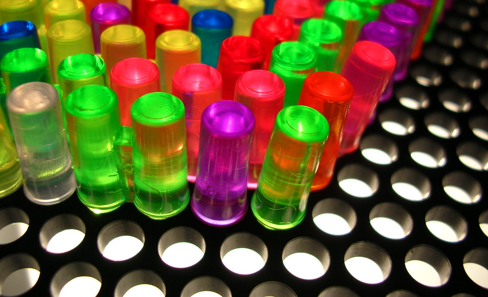

# 💡 litebrite

    A <strong>real-time lite brite game</strong> you can play with anyone!

   
      <a title="⚡️ Play Now" href="https://repl.it/@droxey/litebrite-client?ref=button" target="_blank"><strong>⚡️ Play Now</strong></a> <small><em>(Students)</em></small> &nbsp;&nbsp;&nbsp;&nbsp;&nbsp;&nbsp;&nbsp;&nbsp;
      <a title="👀 Watch Live" href="https://litebrite.live" target="_blank"><strong>👀 Watch Live</strong></a> <small><em>(Teachers)</em></small>
     Lite-Brite is a toy that was originally marketed in 1967. It consists of a light box with small colored plastic pegs that fit into a panel and illuminate to create a lit picture, by either using one of the included templates or creating a "freeform" image on a blank sheet of black paper. There are eight peg colors: red, blue, orange, white (clear/colorless), green, yellow, pink, and violet (purple). Using a standard light bulb, the light is blocked by the black paper except where the pegs conduct the light. When lit, the pegs have an appearance similar to that of LEDs. - [_Wikipedia_](https://en.wikipedia.org/wiki/Lite-Brite)
