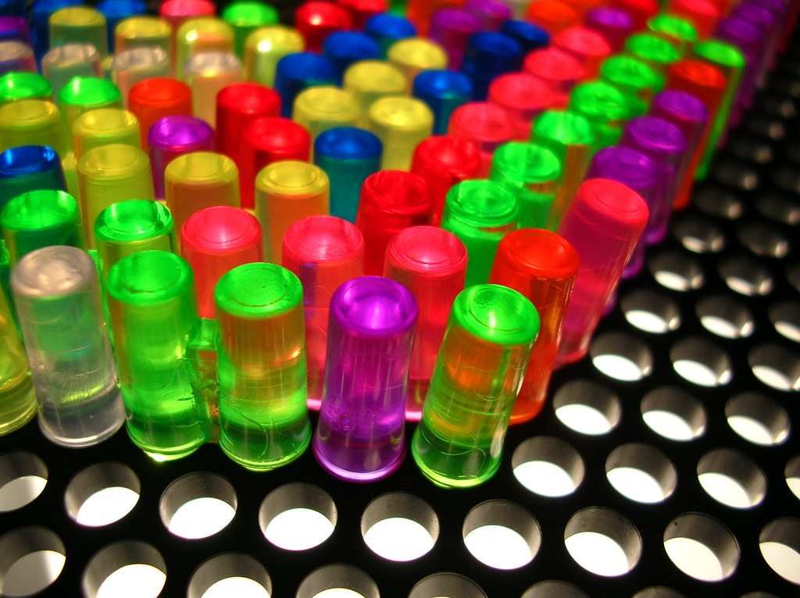

# 💡 litebrite

  

A real-time lite brite board you can share with anyone!

## Play Now

[Visit the Repl.it to Play!](https://repl.it/@droxey/litebrite-client)

## Inspiration

> Lite-Brite is a toy that was originally marketed in 1967. It consists of a light box with small colored plastic pegs that fit into a panel and illuminate to create a lit picture, by either using one of the included templates or creating a "freeform" image on a blank sheet of black paper. There are eight peg colors: red, blue, orange, white (clear/colorless), green, yellow, pink, and violet (purple). Using a standard light bulb, the light is blocked by the black paper except where the pegs conduct the light. When lit, the pegs have an appearance similar to that of LEDs. - [_Wikipedia_](https://en.wikipedia.org/wiki/Lite-Brite)
